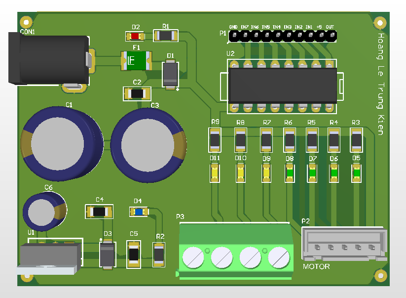

# ULN2003A Stepper Driver

Darlington array driver module.

## Function
Drives unipolar stepper motors.

## Key Specifications
- IC: ULN2003A
- Regulator: 7805
- UI: Channel LEDs

## Hardware Preview

---
Designed by HOANG LE TRUNG KIEN
